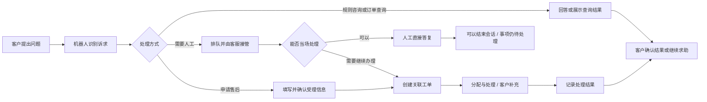
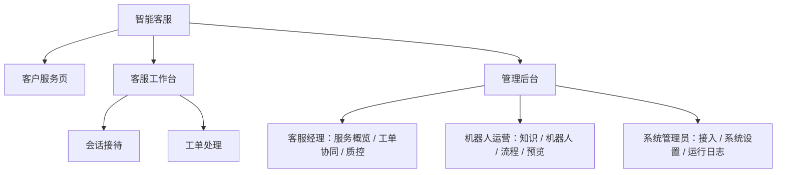

# 智能客服：当前方案与角色分工修改计划

日期：2026-10-02

状态：供产品评审；第二、三部分为建议方案，尚未实施。

产出、主写与最终收敛 Agent：Codex；参与 Agent：Codex（独立只读审查）。

## 阅读结论

当前产品是一套以电商咨询和售后为场景的智能客服 Demo，覆盖客户咨询、机器人答复、人工接待、工单跟进，以及知识、流程和质量管理。客户已有独立页面；内部人员共用一个包含十个菜单的后台。

建议把内部工作区分成 **客服工作台** 和 **管理后台**。一线客服围绕“会话接待、工单处理”工作；客服经理在管理后台查看服务情况、处理质量问题。知识维护、机器人配置和系统管理也归管理后台，按职责开放。

| 使用入口 | 主要使用者 | 要完成的工作 |
| --- | --- | --- |
| 客户服务页 | 咨询或申请售后的客户 | 提问、查询、申请服务、补充资料、查看结果 |
| 客服工作台 | 一线客服 | 接待客户，把需要继续办理的问题交给工单跟进 |
| 管理后台 | 客服经理、机器人运营、系统管理员 | 管理服务质量、知识与流程、接待规则和系统接入 |

一线以“会话接待、工单处理”两个模块组织工作，沿用当前按需关联的业务关系。两个模块如何协作，见 2.4。

## 一、当前实际方案

### 1.1 实现基线与使用边界

以本地项目提交 `16c73cd76b09b70ba5b6f90801ae91f64589f11f` 为基线，结合当前页面和代码核对。原有《方案文档》作为业务背景；页面和代码用于确认实际能力。

- **场景**：虚构商家“青禾生活”的规则咨询、订单查询、售后受理；内部工作空间名称为“青禾客服”。
- **客户端**：`http://127.0.0.1:8768/?view=customer#playground`，面向客户。
- **内部后台**：`http://127.0.0.1:8768/`，目前统一展示全部内部功能。
- **运行方式**：HTML、CSS、JavaScript 在浏览器内运行，业务记录保存在当前浏览器中。问答使用本地规则与模板，订单使用样例数据。
- **生产边界**：没有已接入真实模型、订单或退款系统的证据，也没有服务端登录鉴权、多人并发和生产部署的验收证据。本文的“当前实际方案”指当前本地实现。

### 1.2 当前页面与用途

以下十个页面在同一后台导航中展示，当前操作者不会因为被称为“客服”就自动失去配置或质检入口。

| 当前页面 | 实际承担的工作 | 当前可见的操作或信息 |
| --- | --- | --- |
| 工作台 | 展示整个工作空间的服务情况 | 服务事项、客户确认、待处理工单、质量待办，以及知识、流程和接待设置快捷入口 |
| 渠道预览 | 检查客户侧接待过程 | 客户会话、服务入口、执行记录、坐席会话跳转 |
| 机器人配置 | 设置机器人对外身份 | 名称、服务说明、欢迎语；保存后用于新会话 |
| 流程编排 | 配置机器人处理步骤 | 节点与连线、条件分支、草稿测试、回归、发布与版本 |
| 知识库 | 维护机器人作答依据 | FAQ 草稿、适用范围、来源、时效、测试、发布与停用 |
| 会话中心 | 人工接待 | 会话列表、接管、回复、结束会话、创建工单、标记问题、客户上下文 |
| 工单中心 | 持续处理客户问题 | 独立建单或从会话建单、分配、补充、完成、撤销、客户异议复核 |
| 质检与日志 | 复核问题并追踪整改 | 质量问题、整改事项、机器人执行日志 |
| 接入与集成 | 展示连接能力与状态 | 已有前端能力与未接入能力说明 |
| 系统设置 | 调整接待及工作空间配置 | 全局接待状态、容量、当前演示坐席、查询开关、数据导出和清空 |

### 1.3 当前客户服务流程

会话结束后，未完成事项和工单仍然保留。工单完成要求填写客户可见说明和内部结果证据；客户可以确认结果，也可以提出未解决异议。当前演示不实际执行退款或发货。

**人工当场答复存在一处闭环缺口**：当前发送人工回复只记录消息，不会将事项推进到“待结果确认”，也没有独立的人工答复结果确认入口。因此，人工把问题答清后可以结束聊天，但若没有经过工单等有效结果路径，事项仍可能留在待处理状态。图中的客户确认适用于已有有效依据并进入待确认的事项。

### 1.4 当前会话与工单的关系

| 对象 | 记录什么 | 当前关系规则 |
| --- | --- | --- |
| 会话 | 一段沟通及接待过程 | 一个会话可包含多个客户问题；会话结束不会自动完成问题或工单 |
| 服务事项 | 客户要解决的一件具体事情 | 关联问题、订单线索、处理状态和结果；可通过明确关联延续到另一段会话 |
| 工单 | 需要人工或异步办理的执行记录 | 每张工单归属一个事项；同一事项有未完成工单或待核异议时，阻止重复建单 |

当前支持没有关联会话的独立工单，建单时同时建立服务事项。因此，当前数据关系并非会话和工单一一对应。

例如，客户在一次咨询里“查物流，再申请退货”：物流查询和退货是两件事情，只有需要后续办理的部分建立工单。客户第二天追问同一退货，应继续查看原工单，保留原受理时间和处理记录。

### 1.5 当前角色与质控能力

当前后台只有“客服小林、客服小周”等演示操作者，没有完整的角色权限分工。会话回复会检查本地接管人；工单更新、质量复核、知识发布和系统配置尚未形成按角色及数据范围统一校验的体系。会话和工单列表目前面向整个工作空间，也没有完整的“我的、我的团队”数据范围。

现有质控以**问题线索复核和知识整改**为主：无知识命中或人工标记形成线索，复核人员判断问题是否成立，确认后填写原因和责任人，再通过关联知识、发布、回归和验收闭合。完整的坐席话术评分、抽检规则、绩效考核和所有类型问题的整改流程均不属于已实现能力。

### 1.6 当前使用上的主要问题

1. **一线任务与管理任务混在一起。** 接待客户时，同时能看到机器人配置、流程发布、质检和系统管理，难以识别自己的工作范围。
2. **管理功能还嵌在接待页面里。** 会话中心底部可以修改全局接待容量、查询开关和演示操作者；右侧展示详细执行轨迹。仅隐藏左侧菜单无法完成分工。
3. **首页和顶部快捷入口仍指向管理功能。** 首页混合质量待办、流程和知识配置；顶部“知识库”“渠道预览”也需要按工作区重新安排。
4. **“自己的工作”尚未建立清晰范围。** 当前列表和统计主要覆盖整个工作空间，不能直接当成某名客服的待办或某个团队的经营指标。

## 二、建议的角色与页面方案

本部分是拟采用的产品分工，需评审确认。采用同一套产品、三类入口，内部复用现有数据和功能。

### 2.1 一线客服：会话接待与工单处理

客服工作台默认进入“会话接待”。一级导航保留 **会话接待、工单处理** 两项；待接待数量、本人正在接待数量和待处理工单放在对应页面中。

| 工作模块 | 页面组织与主要动作 | 完成结果 |
| --- | --- | --- |
| 会话接待 | 左侧按待接待、我接待中、历史会话分组；中间查看消息并回复；右侧显示客户问题、订单线索、机器人处理摘要、相关知识依据及关联工单。允许接管、回复、建单、标记问题和结束会话 | 客户获得当场答复，或形成有负责人继续跟进的工单 |
| 工单处理 | 默认显示本人负责工单；可领取范围内的未分配工单单独展示。支持查看上下文、处理、请求补充、记录结果、查看异议和流转记录 | 每张工单有处理去向、公开说明及必要内部依据 |

建议工单列表按“编号／标题、客户／关联问题、状态、优先级、负责人、受理时间、操作”排列，详情保留关联会话与完整流转记录。历史记录缺少客户关联时显示“未关联”，保留可用的事项与会话线索。

机器人已经做过什么、为什么转人工、客户已经提供什么信息，应在接待页面直接可见。这是智能客服与人工协同的核心体验。详细节点轨迹由管理后台承接；一线只保留处理当前咨询需要的摘要和依据。

客服可以标记“回答不准确、知识缺失”等问题线索，得到“已提交复核”的反馈；质量结论、整改分派和验收由管理后台处理。客服查阅回答依据使用只读视图，知识编辑、停用和发布入口归机器人运营。

### 2.2 管理后台：按管理职责开放功能

| 角色 | 主要功能 | 与一线工作的衔接 |
| --- | --- | --- |
| 客服经理／质控负责人 | 服务概览、范围内的会话和工单协同、质量问题复核、整改分派与验收、接待规则管理 | 查看问题上下文，为未分配或需要调整的工单指定负责人，向运营提交知识整改要求 |
| 机器人运营 | 机器人配置、知识维护、流程编排、草稿测试与发布、渠道预览 | 根据服务问题维护机器人能力；把发布版本和回归结果交给质控验收 |
| 系统管理员 | 接入与集成、系统参数、技术运行日志、数据维护 | 保证系统连接与运行；涉及业务内容的访问另按职责授权 |

小团队可以由同一个人兼任经理和机器人运营，拥有两组功能。是否兼职影响权限组合，不改变一线客服的两个主入口。

管理后台首期复用当前概览和质检能力。概览先明确“当前工作空间”口径；“我的团队”需要有可信的组织和归属数据后再提供。质控首期范围仍为问题复核及现有知识整改，不将菜单迁移描述为完整人工质检系统已建成。

“质检与日志”拆成两种用途：经理查看质量问题、整改及关联服务证据；运营和管理员按权限查看详细执行日志。不能因为查看质量问题，就默认获得修改机器人或系统配置的权限。

### 2.3 现有功能如何归位

| 现有功能 | 建议归属 | 调整要点 |
| --- | --- | --- |
| 工作台 | 管理后台的服务概览 | 一线待办进入接待和工单页面；整体统计归管理侧 |
| 会话中心 | 客服工作台的会话接待 | 保留沟通与交接信息，补充本人及待接待范围 |
| 工单中心 | 客服工作台的工单处理；管理后台的工单协同 | 共用工单记录与详情，按责任范围显示不同操作 |
| 质检与日志中的问题、整改 | 管理后台的质控 | 一线保留“标记问题”，经理负责正式复核与验收 |
| 质检与日志中的执行日志 | 管理后台的运行日志 | 质量问题保留证据链接，详细日志按权限查看 |
| 机器人配置、流程编排、知识库 | 管理后台的机器人运营功能 | 一线只能查阅当前适用的知识依据 |
| 渠道预览 | 管理后台的渠道预览 | 客户继续使用独立客户页；一线可查看所需的客户提交内容 |
| 会话页面中的全局接待设置 | 管理后台的接待规则 | 容量和服务组状态由经理管理；查询工具启停由运营或管理员管理 |
| 系统设置中的演示坐席选择 | 原型演示控制入口 | 正式系统根据登录身份确定操作者；个人接待状态若需自助调整，再单独定义 |
| 接入与集成、导出和高级维护 | 管理后台的系统管理 | 导出、清空等动作按专项权限授权 |
| 首页卡片、顶部快捷按钮、详情跳转 | 随所属工作区调整 | 全部入口遵循同一权限规则，避免从快捷入口绕回管理功能 |

### 2.4 会话和工单：建议按需关联

**建议保留“会话用于沟通，工单用于持续办理”的关系，前台以两个工作模块呈现。** 服务事项继续作为问题关联与结果统计的依据，界面可用“客户问题”解释，不新增一个必须单独操作的一级模块。

| 典型情况 | 建议处理 |
| --- | --- |
| 客户问服务时间，机器人或人工当场答清 | 留下会话记录，无需为了结束聊天创建工单；人工答复后的事项确认按下方补齐项处理 |
| 客户申请退货，需要核实和后续办理 | 从当前会话创建关联工单，带入已知问题及订单线索 |
| 同一次会话包含两个需要分别办理的问题 | 分别关联对应问题的工单；同一问题避免重复受理 |
| 客户再次询问已有问题的进度 | 找到并继续原工单，保留原受理时间 |
| 客服独立登记需要跟进的问题 | 支持独立工单，明确问题与客户线索，不虚构一段会话 |

同一事项存在未完成工单或待核异议时，进入原记录。结束聊天只结束沟通；完成工单只记录处理环节结果；客户确认继续按现有条件记录。

**可选补齐：人工当场答复的结果确认。** 对无需后续办理、没有关联工单的咨询事项，建议允许当前接管客服填写处理结论和可追溯依据，提交为“待结果确认”；客户明确确认后才计为已解决。缺少结论或依据时不能提交，不能仅凭发送一条回复自动判定解决。客户未反馈时继续待确认，反馈未解决则回到待人工。存在关联工单的事项继续遵循工单结果和异议规则。

这项补齐需要单独确认。若此次只调整工作区与职责，则保留现有事项状态规则，并明确人工直接回复尚未形成可确认结果，不把这些事项计入已解决。

**工单异议复核与服务质控是两类工作。** 前者处理客户对办理结果的疑问，保留在工单中，由有处理权限的负责人依据证据操作；后者评价服务问题并追踪整改，归经理。需要升级经理裁决的投诉规则可另行定义，不能仅凭“异议”一词就自动判定客服违规。

### 2.5 数据范围和操作权限

下表是建议规则，尚未实现。首期先在 Demo 中表达清楚，真实上线时由服务端校验身份、权限和记录归属。

| 角色 | 建议可见范围 | 建议可操作范围 |
| --- | --- | --- |
| 客户 | 本人的会话、问题和工单公开信息 | 咨询、确认申请、补充材料、确认结果、提出异议 |
| 一线客服 | 分配给自己的会话和工单、明确可接待／领取的公共池；处理本人任务所需的关联上下文 | 持有接管权时回复；处理本人负责工单；领取允许领取的任务；标记服务问题 |
| 客服经理 | 授权管理范围内的服务记录、待办与质量问题 | 分配和调整范围内的工单负责人；质量复核、整改分派与验收；管理接待规则 |
| 机器人运营 | 授权知识、流程、配置和整改所需证据 | 编辑、测试、发布及停用相应服务能力 |
| 系统管理员 | 授权的接入、运行信息和维护对象 | 管理系统配置与维护；业务内容访问单独授权 |

未分配工单先进入允许领取的公共池，领取成功后成为本人负责工单。转派由经理处理；转派后，原负责人失去继续修改的权利，新负责人能看到必要上下文。权限变化、直接打开旧链接和提交动作时，都应重新校验。

历史归属需要单独处理：当前会话结束会清空“当前接待人”。“我的历史会话”不能只按该字段筛选，应从可信接待记录保留历史关联；无法确定归属的旧记录进入管理侧待确认范围，不自动猜测负责人。

跨角色使用同一份会话、问题和工单记录。机器人回复权、人工接管权、工单负责人和质控权限分别判断；取得其中一种权限，不自动获得其他权限。

## 三、修改计划

### 3.1 分步实施

| 阶段 | 工作内容 | 可交付结果与完成条件 |
| --- | --- | --- |
| 方案确认 | 确认三类入口、两个一线模块、会话与工单关系，以及数据范围 | 文末决策项有明确结论，再进入应用修改 |
| 第一阶段：工作区和职责拆分 | 拆分客服工作台与管理后台；重排导航、首页、顶部按钮；迁移全局设置与执行日志；同步角色可见页面和动作边界 | 客服从默认入口能完成接待和工单处理；从菜单、旧地址和关联按钮进入管理功能均受到一致限制。这里是前端原型验证，不宣称完成生产鉴权 |
| 第二阶段：任务归属与历史兼容 | 明确本人、公共池和管理范围；实现领取、转派的演示规则；处理历史接待关联；保护原有会话、事项、工单和未提交草稿 | 两名演示客服分别看到正确任务；错误操作者不能提交变更；历史记录可追溯；跨模块继续同一工单 |
| 第三阶段：完整走查 | 走通客户咨询、人工接待、工单跟进和经理复核；更新使用说明与验收记录 | 下方场景全部通过，产品页面与文档一致 |

第一、二阶段可以在开发中分步检查；对外展示“按角色使用”的新版本前，需要合并验收。只完成导航变化的中间版本不作为分工完成的交付。

2.4 的人工答复确认仅在选定补齐时纳入第二阶段，单独验证结论、依据和客户确认条件；未选定时不增加该行为。

真实生产化另立范围：后端身份与数据权限、持久化、多人互斥、真实模型和业务接口，以及部署验收。角色菜单的完成不能代替这些条件。

### 3.2 预计修改位置

| 位置 | 预计涉及内容 |
| --- | --- |
| `app.js` | 工作区入口、导航、页面组合、数据筛选、动作校验、详情与返回路径 |
| `index.html`、`styles.css`、`product.css` | 工作区名称、顶部入口、角色信息和接待布局 |
| `engine.js` | 任务归属、领取与转派校验、历史接待关联；保留原有事项及工单状态约束 |
| 现有界面、逻辑与浏览器测试 | 角色越权、任务归属、旧链接、历史记录和服务闭环验收 |
| `README.md`、`方案文档.md`、相关使用说明 | 按验收完成的能力同步说明；本评审稿在方案确认前只作为修改依据 |

既有用户输入、客户说明、内部证据、知识版本、流程快照、首次受理时间和客户确认记录应保留。调整数据结构时先验证旧数据读取与备份恢复，不因角色变化重新生成业务记录。

### 3.3 验收场景

以下均为**待实施后的验收要求**。

| 场景 | 预期结果 |
| --- | --- |
| 一线客服进入系统 | 默认看到会话接待；一级导航为会话接待、工单处理；不出现管理配置和质量复核入口 |
| 客服尝试旧质检地址或旧快捷按钮 | 提示无权限或返回有权页面；页面动作也受限制 |
| 客户问题转人工 | 客服看到完整对话、机器人处理摘要、已提供信息和已有工单；接管后才能回复 |
| 客户只咨询规则 | 可以完成咨询；不会强制生成工单 |
| 人工当场答复后的事项确认（选定补齐时） | 客服记录结论和依据后进入待确认，客户确认后才计为已解决；单独发消息或结束聊天不推进事项，已有工单不能绕过办理规则 |
| 客服从会话创建工单 | 预填已知信息，多个问题时明确归属；预览取消不建单，重复确认不产生重复受理 |
| 工单待补充、完成或出现异议 | 公开说明与内部依据分开展示；聊天结束后仍可继续工单；原有结果确认约束有效 |
| 两名客服分别处理任务 | 列表和操作遵循归属；未领取、已被他人领取或转派后的错误操作被阻止 |
| 查看历史会话和独立工单 | 不因当前接待人为空而丢失可追溯历史；独立工单仍可处理；缺失归属有明确管理入口 |
| 客服标记问题，经理复核 | 客服只登记线索；经理能回看必要证据并记录复核结论；运营接到知识整改后可继续既有回归与发布流程 |
| 取消、校验失败、无数据或保存失败 | 保留尚未提交的内容；无记录与无搜索结果分别提示；保存失败不显示成功 |
| 升级并刷新旧工作空间 | 会话、事项、工单、版本和结果记录保留，跨页面关联正常，不要求清空浏览器数据 |

### 3.4 需要确认的决策

| 决策 | 建议采用 | 另一选择及影响 |
| --- | --- | --- |
| 一线客服的主导航 | 会话接待、工单处理两项；待办嵌入这两个页面 | 独立增加“我的工作台”，适合以后待办更复杂时使用 |
| 人工当场答复的结果确认 | 补齐客服记录结论与依据、客户确认的路径，让无须建单的咨询也能闭合事项 | 此次只做角色分区，保留该缺口；人工直接回复的事项不得冒充已解决 |
| 管理后台的职责 | 区分经理、运营、管理员，可由同一人兼任 | 一个演示管理身份拥有全部管理功能，演示更简单，但不能表达岗位权限差异 |
| 一线的领取与分配方式 | 本人任务＋允许领取的公共池，经理可转派 | 全部由经理分配，一线不主动领取；队列和未分配工单的交互需相应调整 |

## 附：核对依据

| 核对内容 | 依据与证据状态 |
| --- | --- |
| 十个内部页面、统一导航与快捷入口 | [app.js](../app.js) 的 `navItems`、`renderNav`、`renderOverview`；[index.html](../index.html) 的顶部结构。代码核对 |
| 会话接待、工单、质检、机器人配置页面 | 当前本地页面实际读取；会话中心中的全局接待设置、详细执行轨迹，以及工单和质检列表均已核对。未提交回复、工单或配置变更 |
| 接管与结束会话 | [engine.js](../engine.js) 的 `takeover`、`sendAgent`、`finish`。代码核对，包含结束时清空当前接待人的行为 |
| 人工直接答复后的事项状态 | 纯内存复现“请求人工→接管→回复→结束”：会话为 `ended`，事项仍为 `needs_human`，工单数为 0，客户确认条件为 false，待处理事项为 1。未写入浏览器业务数据 |
| 事项与工单、补充、确认和异议 | [engine.js](../engine.js) 的 `createTicket`、`advanceTicket`、`addTicketReply`、`confirmItem`、`reviewDispute`。代码核对 |
| 当前质量整改的限制 | [engine.js](../engine.js) 的 `reviewIssue`、`verifyRemediation`、`closeRemediation`。代码核对，闭合验收限定于知识整改 |
| 本地运行、数据保存及接入边界 | [README](../README.md)、[产品体验说明](产品体验调整.md)，并核对 [app.js](../app.js) 的数据读取与展示模式 |

页面读取和代码核对用于描述现状；不作为真实生产运行或第二、三部分功能已经实现的证明。
