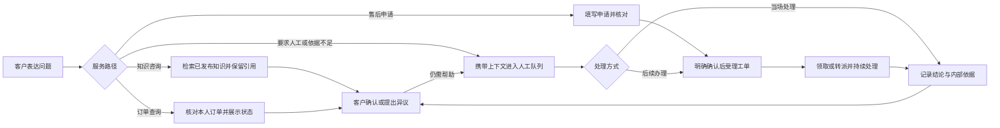

# 智能客服产品方案

产出 Agent：Codex。集成、主写、参与与最终收敛 Agent：Codex。用户附件原始产出平台未标明。

## 电商工作空间

电商入口 `?data=ecommerce` 使用独立 schema 5 数据，覆盖商品与分包查询、规则咨询、双商品诉求、杯子一件退货退款、补件与撤回、原事项异议复核、待接收交接、流程评测、分类整改及事项看板。客户、客服、经理、知识运营和演示管理员沿同一事项接续；经理审批与客服接管分别留痕。

办理结果须有对应审批决定、核实依据或模拟执行回执。退款金额来自商品规则和审批快照；通知与客户反馈单列，完成会话不代表完成退款。政策知识引用实际结构规则的版本，运行正反例与业务全流程测试后才能发布。

业务存储和草稿与通用 V4 隔离，V4 原始数据可导出，默认蓝色主题共用。金额、仓库、财务与通知均为本地演示，没有真实资金或消息发送。开发契约见 [电商方案](docs/当前方案与角色分工修改计划.md)，可操作路线见 [演示脚本](docs/演示脚本.md)。

以下各节描述通用 V4 的产品结构；电商具体命令和适用边界以电商方案为准。

## 目标与范围

智能客服验证一条可追踪的服务链：客户表达问题，系统提供有依据的答复或查询结果，需要人工时携带上下文交接，需要后续办理时创建工单，处理完成后接受客户确认或异议。服务中的知识缺口进入运营整改，并用原始问题检查整改效果。

适用场景是电商的规则咨询、商品使用、订单物流与售后受理。客户、订单、规则和办理结果均为虚构样例，客户使用编号，客服显示为客服 01 / 02。面客页面使用“服务中心”和“在线客服”。目标用户与业务价值属于产品假设，当前没有真实客户试点、经营指标或降本效果证据。

V4 为本地前端原型。知识检索使用标准问题与关键词，订单取自本地样例，角色由页面切换。真实模型、RAG、业务接口、支付退款、通知、服务端鉴权、多人同步与多租户隔离均未接入。有限的接待策略配置用于验证路由边界，不提供任意节点的流程画布。

## 工作区与职责

| 工作区 / 角色 | 入口与页面 | 主要职责 |
| --- | --- | --- |
| 客户服务 / 客户 | `#customer`；独立入口 `?view=customer#customer` | 描述问题、查本人订单、核对申请、补充资料、查看历史与反馈结果 |
| 手机端演示 / 同一客户 | `#mobile`；左侧手机聊天、右侧留白 | 共用客户服务的咨询、订单、申请、反馈与草稿，不新增角色 |
| 客服工作台 / 一线客服 | `#desk/inbox` 会话接待、`#desk/tickets` 工单处理 | 领取任务、公开回复、内部备注、当场记录结果、办理工单、标记服务问题 |
| 运营后台 / 服务经理 | 服务概览、团队协同、质量复核、接待规则 | 看处理负荷与结果、分配负责人、复核线索、验收整改、设置接待目标 |
| 运营后台 / 知识运营 | 知识与答复、接待策略与测试、服务改进队列 | 保存草稿、执行回归、发布或停用知识、配置策略、关联整改知识 |
| 运营后台 / 系统管理员 | 接入与运行、角色与职责、操作审计、数据维护 | 检查接入边界、查看操作记录、导出当前和旧版数据 |

运营后台提供三种运营角色，客户与一线客服各有独立工作区。命令入口检查本地角色和任务归属：客服领取后才可修改，转派后原负责人失去修改权；经理不能代发客服回复，运营不能办理工单，管理员不能代替运营发布知识。这些检查不构成服务端身份认证。

## 业务对象与状态

| 对象 | 保存什么 | 状态与约束 |
| --- | --- | --- |
| 会话 | 一段沟通、当前接管人、历史接待人、消息、策略快照 | 机器人、排队、人工、结束；关闭会话不删除未完成问题或工单 |
| 客户问题 | 一项诉求、关联订单、关联会话、处理状态 | 未完成、待客户补充、处理完成；多诉求可形成不同问题 |
| 处理结果 | 客户可见结论、内部核对依据、记录人和时间 | 已有结果时保留历史；结果证据不等于真实业务系统回执 |
| 客户反馈 | 客户对结果的明确动作 | 未反馈、待反馈、已确认、有异议；沉默不会自动记为确认 |
| 工单 | 正式受理或纯跟进的问题、负责人、首次建单时间、处理目标、回访与历史 | 待领取、处理中、待客户补充、结果已记录；同一问题复用已有未完成工单 |
| 关闭快照 | 本次小结、当时 SOP 状态、遗留安排、关联工单与回访 | 与会话关闭一并保存；后续修改及异议不改历史快照 |
| 回访 | 工单负责人、目的、计划时间、内部备注与执行历史 | 待回访、已联系、取消；未联系上须改约未来时间，不自动办结业务 |
| 知识 / 接待策略 | 草稿、已发布版本、历史版本、回归结果 | 草稿不生效；发布需要验证通过且依赖仍匹配 |
| 服务问题 | 原始提问、复核依据、根因、整改知识、验证结果 | 待复核、已确认、整改中、已验收或已排除 |

“处理完成”表示已形成答复或办理结果，“客户明确确认”表示客户主动认可，两项独立统计。异议会将原问题恢复为未完成；存在已记录结果的工单时重开原单，保留首次受理时间和处理历史。

## 客户服务流程

客户明确要求人工时优先进入人工队列；已知否定表述和“人工智能”等词组按规则排除。订单查询与售后申请分别识别，缺订单号时保留待补问题。客户在补充订单号前插问知识，不清除原有待补关系。任意自然语言、多任务推理和通用否定理解不在能力证明范围内。

知识只从已发布、已生效、未过期且未停用的内容中检索。标准问题包含匹配或至少两个关键词命中才形成候选；最高匹配并列但答案不同时作为冲突处理。未命中或冲突进入人工队列并生成待复核线索。关键词重合不能证明答案覆盖了客户的具体问点。

查询本人订单才展示商品与进度；无法核对归属时不给出他人订单内容。售后申请填写标题、本人订单、退货或换货类型、申请原因、换货要求及可选补充说明；明确类型和客户原话可预填，未知信息留空。只预填可明确识别的换货要求，含糊或未说明时留空，由提交人核对填写。预览后确认时重新检查订单事实、接待权与已有记录；取消不建单，受理不会调用退款接口。客户可从“服务进度”补充原工单，从“历史咨询”返回原沟通。

## 人工接待与工单办理

会话接待由队列、沟通区和右侧 SOP 看板组成，左侧保留“会话接待、工单处理”两个菜单。客服可在“待接待”“我接待中”“我的历史”间筛选；接管检查服务组开放状态、个人在线状态和容量。看板常显八个节点：确认诉求、核对订单、查询物流、退换货办理、补充资料、记录处理结果、回访安排、结束沟通。退换货节点常显“确认类型与原因、核对规则及缺失信息、核对申请、登记受理”四个子步骤。节点 1—7 属于客户问题，结束沟通属于当前会话；切换问题不合并状态。

节点可展开核对订单、物流、预填及办理记录。动态建议展示问题、答复、来源和版本；插入前如已有公开草稿，可追加、替换或取消，内部备注不作为公开草稿来源。新消息、知识失效或更新、订单变化及接待权变化会使未发送建议失效；已编辑正文保留，发送前须重新核对依据。

公开回复面向客户，内部备注仅用于协作。无需后续办理的问题，可填写“客户可见处理结论”和“核对依据”记录当场结果；已有工单的问题必须从工单提交结果。客服结束沟通时填写小结，并逐项处理已触发但未完成的业务节点：引用有效原工单、建立有负责人和未来目标的跟进工单、安排依附工单的回访，或记录客户撤回/不适用依据。已受理售后不能通过撤回或不适用直接取消。安排、快照和关闭须一并保存成功。

纯跟进工单使用 `followupOnly` 标记，表示后续核实责任，不把退换货节点或其子步骤标为登记完成。资料齐全后可经结构化确认沿用该单登记售后，保留原编号、负责人和历史。回访与工单共用负责人和权限；转派后未完成回访随工单转移，历史关闭快照保留原安排。

工单支持继续处理、请客户补充和记录办理结果。客户可见说明始终必填，记录结果时内部依据必填，内部协同备注可选。客户补充后继续原单；客户对结果提出异议时填写原因，原问题和原工单恢复办理。经理转派保留首次受理时间和历史，原负责人提交旧表单会被拒绝。

人工接管后自动发送默认关闭。客服为当前会话明确授权后，AI 等待 30 秒，最多续答 2 轮；每轮需要新客户消息且不能重复回答同一条。只使用有效知识、本人订单事实或必要信息收集话术，不自动受理、承诺退款、记录办理结果或关闭会话。输入、回复、暂停、转派、关闭、客户离线或拒绝 AI 会停止待发内容；本地暂停保存失败时，当前标签页仍抑制自动发送并保留草稿。

首响从进入人工队列起计算，公开人工答复或公开处理结论才停止计时，内部备注和标为“AI 协助”的自动消息不算首响。工单处理目标按自然时间计算；异议重开保留首次受理时间，并按当前规则设置新的处理期限。不提供营业日历或节假日 SLA。

## 知识发布与服务改进

知识编辑包含标题、标准问题、答复、来源、关键词、生效日期、可选失效日期、正例和反例。必填文本去除首尾空白，拒绝全空；知识需 2–20 个关键词，正反例不能归一化后相同，失效日期必须晚于生效日期。

保存草稿后运行回归。回归检查人工路由、本人及他人订单、查询失败、多诉求，以及当前有效知识的正反例。待发布知识还需处于生效区间。发布动作再次执行检查，并比对草稿及已发布依赖指纹；输入或依赖改变后须重新测试。历史消息保留当时的知识原文、来源和版本。

接待策略仅配置人工触发词和售后受理开关，“人工”触发词必须保留。每段新会话保存开始时的策略版本，策略发布不改变正在进行的会话；后续知识检索使用当时有效的已发布知识。草稿中的订单失败选项只用于单条隔离测试，不生成业务记录或写入接待配置。

服务改进由经理先复核线索，填写依据及根因，或排除不成立线索。确认后运营新增或修订知识、发布并关联整改。经理验收时原样重放客户问题，要求命中关联知识，再运行全量规则回归；知识仍有草稿、不可用、原问题未命中或回归失败时都不能验收。该闭环覆盖知识与答复问题，不代表完整质检、模型评测或培训整改系统。

## 概览、保存与接入边界

概览以当前工作空间中的客户问题统计处理完成与明确确认，另显示待接待、办理中工单、逾期、待复核和客服负荷。无记录时显示零，不生成趋势或推算满意度、完整自动解决率与真实经营收益。

正式业务写入先保存成功，再更新页面业务状态。数据无法读取时保留原始值并阻止继续办理；保存失败时不提示成功。旧标签页发现存储变化后拒绝覆盖并提示刷新。这是本地冲突防护，不是分布式互斥或多人事务。

通用 V4 运行时位于 `ecommerce-v1.html?data=v4` 与 `src/`，使用 `qinghe-support-v4`。`legacy.html` 运行根目录历史模块，继续访问旧保存键；V4 不导入、不覆盖旧业务数据。当前默认 V2 单文件由 `build_single.py` 生成，通用 V4 使用备份源码入口，常规本地运行用 `run.py`。

已有 V4 记录的内置默认文案由 `src/copy.js` 精确匹配更新，不对任意文本执行全局替换。会话、订单、工单编号、受理时间和业务关系保留；手写消息、备注、知识草稿与表单草稿保留。覆盖前原样备份到 `qinghe-support-v4:before-copy-v1`；已有不同内容的备份时另存 `:1`、`:2` 等副本，不覆盖既有备份。内置知识来源变化后清除知识与策略的缓存回归结果，发布前须重新验证。

本地业务校验、页面操作和历史模块分层验证，具体要求与实测状态见 [验收矩阵](docs/验收矩阵.md) 与 [SOP/手机端验收证据](tests/evidence/sop-mobile-review.json)。连接状态由演示控制切换，切 Tab 或客户沉默不判为离线。真实 iOS 键盘、设备网络和推送未验证；导出下载落盘及再读取不作为已验收能力。生产化须另行设计服务端身份及数据归属、持久化事务、订单与退款接口、幂等、消息通知及独立效果评测；这些不属于本地原型的交付完成标准。
