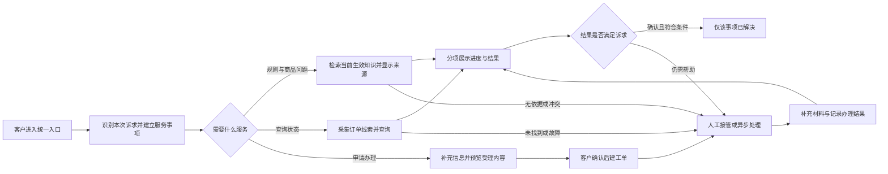
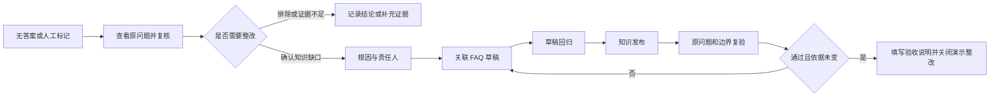

# 通用智能客服平台产品方案
## V3.2｜从客户咨询到处理结果的闭环演示

版本：V3.2　日期：2026-09-28　适用范围：产品经理面试、产品评审、前端验收与真实试点设计。

实现由同目录的 V3.2 前端提供，公开源码入口为 `ledunghung19111975-cell/customer-service-demo`。方案与同目录代码共同描述当前能力；历史基线和变更见评审记录。

### 先看这套方案解决什么

客户来找客服，不只是为了得到一句回答，还可能要查订单、申请售后、补充资料和追踪处理。平台需要把“回答了什么”和“事情办到哪一步”分开记录，让机器人、人工和工单能够接续同一件事；后台则要能维护回答依据、调整服务流程，并把发现的问题改到下一次服务里。

本项目以虚构电商品牌“青禾生活”为首期场景。客户从一个入口完成规则咨询、订单查询和售后受理；客服、运营和质检在同一个工作台继续处理。电商是验证场景，“通用平台”是后续抽象方向，不代表已经验证跨行业复用。

本版首先展示三条连续链路：**客户提出问题到结果确认；后台修改知识或流程到前台生效；发现知识缺口到整改验收。** 面试演示先走这三条链，不逐页介绍所有菜单。

### 阅读与证据边界

“已演示”表示本地前端有相应动作和状态，已在明确的测试范围内验证；“前端后续”表示交互或模拟逻辑尚未补齐；“试点待接入”表示需要真实模型、服务端、业务系统或运营数据。任何“已演示”都不等于已经上线。

会话、服务事项和工单分别记录沟通、客户诉求和处理进度。客户确认有依据的事项结果后才计为已解决；结束聊天不改变未完成事项。

| 能力 | V3 可以操作的部分 | 仍然不能证明的部分 |
| --- | --- | --- |
| 客户服务主线 | 三类入口、固定多事项示例、补参、受理确认、人工与工单、分项结果 | 通用语义理解、任意多意图、真实售后执行 |
| FAQ 与知识 | 文本问答、来源范围时效、草稿／现行版本、回归发布、停用和历史引用 | 文件解析、向量检索、权限 RAG、模型生成质量 |
| 流程编排 | 九类节点、拖动连线、独立配置、条件分支、按图执行与调试、无环校验、发布回归、版本与回滚 | 循环、子流程、并行调度、真实工具调用、审批和灰度发布 |
| 人工与工单 | 本地回复权、全局容量模拟、公开／内部说明分离、补充、异议重开 | 服务端互斥、多坐席并发、技能调度、真实 SLA |
| 质量整改 | 知识类问题的证据、责任人、关联变更、回归和验收 | 所有根因的通用整改、独立专家结论、生产效果 |
| 统计与安全 | 事项级演示计数、本地拒绝反馈与文本转义 | 成熟队列解决率、成本收益、真实鉴权与数据隔离 |

验收覆盖确定性逻辑、界面逻辑及本地浏览器交互，证据分层与未覆盖项详见[验收矩阵](docs/验收矩阵.md)。

## 一、产品定位与业务目标

### 1.1 服务对象与首期问题

首期目标画像是有稳定咨询量、已有商品与售后资料、复杂事项需要人工跟进的电商商家。该画像沿用原方案的产品假设，尚无本项目客户访谈、合同或线上经营数据作为验证依据。

需要验证的业务问题有四类：高频规则反复答、订单和问题信息反复问、机器人与人工之间交接断开、工单结案后仍不知道客户是否得到结果。平台分别通过统一知识、按事项采集、携带上下文接续和分项确认来改善这些问题。

真正启动试点前，应取得脱敏咨询样本、现行 FAQ、售后流程、人工接待与工单记录。先确定哪些问题值得自动承接、哪些必须保留人工，不把所有客服咨询都交给模型。

### 1.2 使用者与责任

客户负责说明需求、确认提交、补充资料和反馈结果。一线客服负责接管、核实与解释，二线处理人员负责异步业务处理。运营维护知识和流程；质检复核问题、追踪整改；主管对接待容量、服务质量和效果负责。技术负责真实接入、权限、持久化和运行保障。

V3 由一个操作者在同一标签页切换这些视角。页面中的“客服小林／客服小周”是演示身份，不是登录认证；运营、质检与发布权限尚未做真实角色隔离。

### 1.3 核心目标

首期先证明：客户不必重复描述，查询与办理不会混淆，未完成的事项始终有处理去向，后台改动能够被检验并影响下一次服务。真实试点再观察有效解决、重复联系、整体耗时、人工投入和持续运营成本。

不以聊天轮次更多、回答更长或页面更多作为价值。不把导购增收、主动营销、私域召回纳入首期核心证明，也不将前端本地统计写进简历作为实际降本成果。

## 二、方案选择与范围取舍

### 2.1 模型、规则、工具和人工的分工

目标方案中，模型负责理解不同表述、辅助拆分诉求、抽取事实和组织回答。确定性规则负责必填项、格式、状态转换、权限门槛和分支限制。业务接口提供订单、履约和办理结果等事实。人工负责争议、资格核验、资料冲突与高影响操作。

V3 没有调用模型：用可解释的关键词和模板验证上述业务分工。针对“不要转人工”等已列样本修正规则，不等于获得通用否定理解能力；固定的“查物流并申请退货”能够拆分，不等于任意复合诉求都能正确处理。

真实接入后，模型输出只形成候选诉求与字段，仍须通过业务校验。低置信、证据不足和服务范围外请求要澄清或转人工；不能把模型表达的确定程度当成授权或办理资格。

### 2.2 采购、集成与自建

真实客户已有成熟客服系统时，优先判断是否可以复用会话、坐席和工单，仅补充知识问答、信息采集与业务连接。主要问题是资料混乱时，应先改善知识与 FAQ；标准客服能力占主导时，应比较现有 SaaS 与实施成本。只有差异化需求确实无法通过配置或集成满足，才讨论完整自建。

本项目的静态前端用于验证产品机制，不是“所有客户都应该自建客服底座”的论据。采购或自建取舍应比较同一场景下的总成本、维护责任、接口限制、数据迁移及退出成本。

### 2.3 实现重点

演示重点是诉求路由、办理边界、事项结果、人机接续、知识生效与整改闭环，按十个页面组织操作。

自由拖拽、多租户、自动退款、多渠道通知、文件知识入库、复杂权限和真实指标平台不在当前实现范围。单一事项当前最多保留一张未完成工单；多个并行子工单、复杂依赖和自动拆单属于后续需求。

## 三、总体架构与既有代码关系

### 3.1 一条服务主线

聊天可以在其中任何阶段结束。已创建的事项和工单继续保留；不把图中的“本轮回复结束”解释成“整个服务完成”。

### 3.2 本地实现与未来服务边界

`index.html` 提供页面骨架，`styles.css` 定义页面样式与事项布局。`app.js` 负责页面、表单、展示模式和存储；`engine.js` 负责诉求模拟、事项状态、工具样例、知识、人工、工单、评测与发布规则。测试直接调用同一个逻辑模块，而不是另外写一套测试专用业务实现。

所有数据在本地 `state` 中，状态通过浏览器保存。逻辑职责可以映射到未来的会话服务、事项服务、知识服务、流程执行、业务工具、坐席工单、质量与审计，但本版没有这些已部署的独立服务。初次试点也不要求立即拆成微服务。

OpenSearch-VL 未集成到本项目；现有知识问答由本地关键词规则执行。

### 3.3 迁移验证的边界

“企业设备报修”仍可作为后续纸面迁移场景：把订单换成资产编号、售后规则换成使用与报修知识、售后服务组换成运维组。但当前路由和卡片仍有电商专用逻辑，尚不能只靠替换配置完成迁移。

后续验证应记录哪些变化只需改知识、字段和工具适配器，哪些迫使修改核心状态逻辑，再决定哪些能力值得抽象为通用平台。没有第二场景运行证据前，不宣称跨行业复制已经成立。

## 四、服务对象、状态与结果定义

### 4.1 会话、服务事项、工单

会话是连续沟通记录，包含消息、当前接待人和流程快照。服务事项是客户要完成的一件事，保存诉求、业务对象、首次受理时间、状态、证据、确认与关联记录。工单是需要异步或人工执行的处理记录。

一个会话可以有多个事项；一个事项可以通过显式关联延续到新会话。工单明确归属一个事项。V3 对同一事项只允许一张未完成工单或待核异议，重复提交提示查看原记录；历史工单保留，不按标题简单去重。

例如，“查物流 SO20260926001，再申请退货”得到两个事项。订单卡片只证明查询已获得样例结果；售后仍需确认受理和人工处理。不能因为查询成功，就把退货事项一起标记解决。

### 4.2 会话状态

| 状态 | 客户与坐席行为 | 关键边界 |
| --- | --- | --- |
| 机器人接待 | 咨询、补参、申请受理、转人工、结束 | 机器人按当前事项处理 |
| 等待接管 | 客户可补充、取消排队或留单 | 机器人不继续业务回答；满载不承诺等待分钟数 |
| 人工离线 | 显示留单和恢复机器人咨询入口 | 必须人工处理的事项不会因恢复机器人而被自动完成 |
| 人工服务 | 当前接管人回复，其他演示操作者只读 | 接管人与发送操作再次校验；仍只是本地模拟 |
| 已结束 | 查看事项与工单，补充指定材料，反馈未解决 | 普通聊天不能继续发送；新咨询新建会话 |

“结束咨询”只改变会话状态。结束前说明记录与后续去向，不把它作为解决确认。已接管坐席整体离线时，释放当前接待人并保留消息；后来切回在线，不自动让旧坐席恢复回复权。

### 4.3 服务事项状态与解决门槛

事项使用“待澄清、处理中、待人工、待客户补充、待结果确认、已解决、已撤销”状态字典。V3 已实现主线与重开相关转换；完整的客户撤销事项交互尚未实现，不能因字典存在就认定功能完成。

知识事项只有拿到当前可用的知识依据、订单事项只有拿到属于演示身份的有效查询结果，才进入待确认。售后事项必须有相关工单完成和结果证据，且没有其他未完成工单或待核异议，才能进入待确认。

客户“这项已解决”只确认选中的事项。没有依据、办理未完成或知识已停用时，禁止确认。没有反馈就继续待确认。结果证据在 V3 是受约束的演示记录，未自动核验外部退款流水。

客户再次反馈未解决时，保留首次受理时间与原确认历史，移出已解决计数。使用“关联原事项再咨询”延续原事项；任意新会话的自动相似诉求归并仍是后续能力。

### 4.4 工单状态及异议

工单主线为“待分配 → 处理中 → 待客户补充 → 处理中 → 已完成”，处理中也可直接完成。进入处理中必须指定有效负责人；待补充要写清材料；完成要同时填写客户可见说明与内部结果证据。撤销必须说明原因，且不会自动撤销客户原事项。

客户在聊天结束后仍可补充待补充工单。原负责人可用时恢复处理中，整体人工离线时回到待分配。消息、材料和首次受理时间不丢失，也不会因此隐式重开已结束聊天。

已完成工单收到异议时，工单暂保留已完成并增加“异议待核”，事项立即回到待人工。坐席提供复核说明和证据后，选择重开原工单或维持原结果。维持原结果时恢复原确认时间，不人为新增一次解决记录。

## 五、核心服务流程

### 5.1 进入与规则咨询

客户先看到规则咨询、订单查询、申请售后三个入口。浏览页面不创建会话，开始咨询或选择服务后才创建。推荐问题先填入输入框，客户主动发送；已有未发送内容时，替换前确认。

“不要转人工，我只问退货规则”应回答当前生效的示例规则，并显示知识标题、版本和来源；“没有订单号，想了解退货条件”不应被强制送入订单查询。只咨询通用规则，不要求提供订单号或个人资料。

无命中、冲突或知识停用时说明当前无法给出可靠答案并提供人工路径。无依据的安全兜底不是自动判定的违规，是否属于业务知识缺口由质检结合服务范围确认。

### 5.2 采集、插问与查询

查询意图缺少订单号时先采集。客户中途问保温杯清洗，应先回答知识问题，保留原采集事项；随后给出订单号时继续原查询，不要求把整段需求重说一遍。

查询卡片显示样例对象、订单状态、物流信息及查询时间。查询未找到、工具停用或模拟超时，不生成虚构卡片。保留已提供的信息，客户可更正、重试或交给人工。

V3 只支持两个演示订单。演示身份不匹配时，不返回具体商品与收件信息；这仅验证本地拒绝路径，不能防止客户修改前端代码，也不能替代服务端归属验证。

### 5.3 售后受理

申请办理与咨询规则分开。V3 对明确申请退货、退款等表达展示受理入口；缺少必要信息则采集订单线索和问题描述。已经提供的信息会预填。客户更换售后订单须回到咨询窗口重新申请，再根据对应路径受理；客服核实后可更正订单，同步到事项与工单并保留原线索，原查询证据不继续用于新对象。

提交前展示事项、标题、业务对象和描述，客户明确确认后才创建工单。取消确认不建单；同一提交标识精确重放返回原工单，冲突内容拒绝重用标识。跨标签页或服务端并发幂等尚未保证。

受理卡片在提交后显示当前登记工单及状态，但历史消息原文保留。所有反馈明确区分“已受理”“处理中”“已完成处理环节”“客户确认事项结果”。本阶段不实际退款、补发或修改订单。

### 5.4 人工接续与容量

客户明确要求人工时，复用当前未完成事项，而不是为“转人工”再增加一个平行诉求。摘要携带诉求、已采集字段、业务对象、查询与知识结果、失败原因和工单；完整消息保留供核对。

在线且容量允许时进入等待接管，真正点击接管才进入人工服务。满载时保留队列并提供补充、取消和留单；离线时只承诺可以在本站查看进度，不承诺短信或即时处理。

V3 容量是可设置的全局演示值，当前占用按人工服务中的会话计数。服务组是路由标签，尚未实现按每名坐席技能、班次和优先级的自动分配；主管应能看出这是模拟承接策略，而非真实排班引擎。

## 六、编排、测试与版本生效

### 6.1 可编辑画布与按图执行

节点库包含开始、事项分流、条件判断、知识检索、订单查询、售后受理、回复消息、转人工和本轮结束九类节点。支持点击或拖入新增、移动、删除、端口拉线、重接与删线，以及画布平移、缩放和适应视图。同一类型可以有多个节点，名称与业务配置彼此独立。

每轮先按本地规则识别服务事项，再由每个事项从开始节点沿实际连线执行。事项分流按事项类型选择出口；条件节点比较客户问题、事项类型、订单号或上游查询得到的订单状态，支持包含、等于、不包含和不为空。条件的满足与不满足分支都要连通。知识节点可限定条目，查询节点可单独模拟超时，售后节点可关闭自助预览，人工节点可指定服务组。

回复消息可输出上游业务结果或自定义文本。知识、查询和售后结果必须经过回复节点才展示给客户；自定义文本不产生知识引用、查询成功或售后完成证据。客户自助售后提交须匹配该事项最近一次执行的受理预览与订单；更换订单须重新咨询申请。待人工事项不能继续用历史预览提交。

试问后只高亮实际经过的节点和连线，逐步展示输入、分支和输出。开始／结束缺失、重复开始、断开的输出、无法到达的节点、无效配置及循环均阻止执行。画布最多 40 个节点，仅支持无环流程；基础诉求识别、样例订单和业务状态规则由本地代码提供，尚无循环、子流程、并行调度或真实 API 接入。

### 6.2 草稿、试问、回归、发布

节点、位置、配置与连线自动保存为草稿，不修改现行版本。单条“运行测试”展示分支和输出，不创建正式会话、事项或工单。单条试问通过不能替代发布回归。

“运行发布回归”执行十条固定的关键行为检查，并对 R 系列问句及当前有效 FAQ 的标准问题中，原配置实际产生知识引用的样本检查引用保持一致，同时保存草稿与知识输入快照。发布必须存在相匹配的通过记录；修改节点配置、连线或相关知识后，旧结果显示失效且不能继续作为发布依据。仅移动节点或缩放视图不使回归失效，也不单独生成业务版本。

确认发布后生成新版本和记录，关联测试标识；新会话绑定新版本，旧会话保持原流程。恢复历史配置先回到草稿，重新回归并发布为更高的新版本，历史不覆盖。审批人与修改人分离、灰度流量、分环境发布尚未实现。

### 6.3 哪些随版本，哪些必须实时

| 对象 | V3 生效方式 | 需要保留的证据 |
| --- | --- | --- |
| 节点、连线与流程参数 | 新会话绑定发布快照；旧会话保持原版 | 流程版本与执行轨迹 |
| 机器人名称与欢迎语 | 新会话使用已保存配置 | 会话内机器人快照 |
| 知识 | 每轮使用当前生效知识；历史回答不改写 | 引用内容、版本、来源与失效提示 |
| 人工在线、容量 | 接管与后续动作读取实时模拟状态 | 运行调整原因、接待状态与消息 |
| 工具开关 | 即时阻断后续查询，旧流程也受影响 | 停用原因与执行异常 |
| 客户授权 | 生产必须每次校验；V3 仅演示身份负例 | 真实授权及撤权证据待后端实现 |

本地执行是同步的，没有真实在途网络响应。生产系统还必须拦截取消后、撤权后或停用后的迟到结果；不能从本版开关测试推导出异步竞态已经解决。

## 七、前端信息架构与页面需求

### 7.1 保留十个页面，围绕任务连接

| 页面 | 当前主要任务 | 可追到的下游 |
| --- | --- | --- |
| 工作台 | 看事项、已确认、未完成与质量待办 | 对应会话、工单、知识与质检 |
| 体验中心 | 从客户入口走完整服务 | 事项、工单进度与当前坐席会话 |
| 机器人配置 | 改身份与欢迎语并新建会话验证 | 新会话与流程配置 |
| 流程编排 | 增删节点、拖动连线、条件分支、测试、回归、发布和回滚 | 真实执行路径、节点输入输出与新旧会话版本 |
| 知识库 | 问答内容、来源时效、草稿、测试与发布 | 真实的本地问答命中与整改问题 |
| 会话中心 | 持有接管权后接待，查看上下文 | 事项、工单、人工标记问题 |
| 工单中心 | 分配、补充、完成证据和异议 | 原事项及关联会话 |
| 质检与日志 | 待复核、整改事项、执行日志三个页内视图 | 原会话、关联 FAQ、回归与验收 |
| 接入与集成 | 说明模拟、未接入的渠道与工具边界 | 不收集真实密钥 |
| 系统架构 | 说明实际前端与未来服务职责 | 本文档与现有演示入口 |

原方案提出的完整列顺序、全部筛选器、超期报表和权限管理没有全部实现。V3 的主要验收是对象能互相追踪、动作能正确改变状态，不用十页存在来替代功能深度。

### 7.2 C 端展示与 B 端操作

“只看客户窗口”隐藏导航、执行轨迹、场景按钮和后台会话选择器，只保留客户服务内容、事项和必要操作。返回运营视角后可以继续原会话；这是一套前端中的演示切换，不是独立部署或访问控制。

会话中心保留列表、聊天、事项与上下文侧栏。选中客户后接管不会因原筛选变更而跳到其他客户。回复按钮仅在当前操作者持有接管权时可用。查看工单或质检后可以回到关联会话。

### 7.3 知识库：FAQ 是首期内容形态

本版用文本 FAQ 验证知识治理，不另建一个只复制相同功能的“FAQ 页面”。标准问题用于定义回答边界，答案用于客户解释，关键词仅用于本地匹配，至少命中两个关键词或问题包含标准问题才作答，否则转人工；来源、范围、维护人与时效用于约束是否可以使用。

新建先为草稿。编辑已发布条目时保留现行答案，草稿发布前不会影响客户。发布前检查必填、时效与同范围标准问题的重叠冲突，再运行草稿回归。草稿测试使用拟发布知识，不算客户服务数据。

停用后，已有会话下一轮不再检索该知识；历史引用保持原文并显示当前失效状态。未来生效的条目可保存草稿，但 V3 不支持预约自动发布。文件解析、切分与索引构建属于真实 RAG 接入范围。

## 八、字段、表单与通用交互规范

### 8.1 关键字段

聊天与问题描述上限为 2,000 字，FAQ 标题 80、标准问题 200、答案 2,000、来源说明 1,000、关键词合计 200；工单标题 80，补充说明、处理说明、内部备注与结果证据各 1,000。机器人名称、服务说明、欢迎语沿用 30、80、300 的上限。

表单拒绝全空白内容并保留正常换行；用户输入以文本转义渲染，不执行 HTML。知识的失效时间必须晚于生效时间；界面时间按当前浏览器时区显示，内部保存 ISO 时间，尚未实现组织统一时区配置。

核心逻辑按 Unicode 码点校验长度，但浏览器原生 `maxlength` 仍可能按 UTF-16 计数，在 emoji 等字符上更早限制输入。统一前后端字符计数属于后续完善项，尚需统一处理。

### 8.2 输入保留与失败反馈

未提交的表单输入、聊天草稿在切页时暂存；保存、发布与暂存分开。关闭弹窗不等于放弃输入，主动放弃只清当前表单。已成功保存的新 FAQ 不再遗留“新建”草稿，避免下一次新建带回旧内容。

校验失败保留输入并显示原因。保存 FAQ 成功但回归失败时，要明确“草稿已保存、测试未通过”，不能给出笼统失败使人误以为内容丢失。工单更新后“下一状态”恢复待选择，不能连续点击误推进。

本地存储失败显示当前页面临时有效，不声称刷新后可恢复。V3.2 沿用 V3.1 的存储键并补齐缺少的画布；更早版本的独立存储键保留，不自动迁移。当前不支持多标签页同时写入，也不保证不同浏览器或地址同步。

## 九、质量运营与整改闭环

### 9.1 先判断问题是否成立

无答案、工具失败、客户未解决和坐席标记都可以形成线索，但不自动判违规。质检要看原问题、回复、执行原因和完整上下文，选择已确认、已排除或信息不足。

例如“礼品卡可以分多次使用吗”没有知识时，机器人正确转人工。只有业务确认它应属于服务范围，才将知识覆盖缺口登记为整改问题；不能把正确拒答当作答错。

确认问题必须填写根因与责任人。原证据和会话可返回查看，复核草稿保留。V3 的复核、知识维护和验收由同一演示操作者完成，不代表已经建立独立质检组织。

### 9.2 本版支持的知识整改

从整改记录可以追到知识条目、发布版本和测试记录；没有关联知识、没有发布、原问题仍不命中或验证后依据发生变化，都不能关闭。

当前闭环仅适用于知识类整改。排班、培训、规则、工具修复等根因仍可以登记，但没有完整匹配的措施与验收实现，不能借一个 FAQ 测试把所有问题都关闭。生产缺陷还需真实服务验证，模拟通过不足以证明修复有效。

## 十、指标口径与价值验证

### 10.1 当前页面展示什么

工作台只展示本地服务事项数、客户已确认事项数、未完成事项、待确认数、待接管会话、未完成工单和知识／质量待办。它们包含初始化样例与本次操作，是当前快照，不是某月经营结果。

工单有待核异议时仍算未完成；事项收到未解决反馈后移出已确认计数。测试执行不创建客户服务事项。内部“未人工参与的确认数”也只是演示计数，不标为真实 AI 独立解决。

### 10.2 真实试点的统计单位

以服务事项为基本单位，按首次受理时间建立同期队列。观察窗口 W 可先讨论 7 天，但这是待业务确认的参数，不是行业标准。未满窗口的事项单列观察中；不能把尚未等待足够时间的新事项拿来报告最终解决率。

有效解决率：窗口内有结果依据、符合事项解决条件且没有未解决复发的事项数，除以同一成熟队列的有效受理事项数。AI 独立、人机协作、人工主导分别记录；转人工历史不能被后续机器人回复抹掉。

未知诉求、失败、范围外咨询、取消和没有反馈不能为了提高指标临时剔除。重复消息归并但保留首次受理与成本；跨会话重复求助和正常补充资料分开。无反馈仍待确认，不默认满意或解决。

### 10.3 质量、时间与成本

同时观察重访、整体解决时长、人工有效处理时间、未完成等待年龄、满意度与参评率，以及错误承诺、越权披露和漏接等质量护栏。只统计已解决时长会掩盖积压，因此必须同时报告未解决事项。

每个有效解决事项的成本，以同一队列、同一窗口发生的人工、模型检索、知识运营、系统运维与实施分摊成本为分子，窗口内有效解决数为分母。未解决事项消耗不能丢掉，分母为零显示不可计算。

比较必须匹配渠道、问题类型、时段和复杂度。释放人工容量不自动等于减少财务支出。V3 没有真实队列、计时、成本和对照数据，不计算 ROI，也不报告“提升了多少”。

## 十一、评测与发布验收

### 11.1 验证范围

核心逻辑测试覆盖状态转换、业务拒绝条件、数据关联、知识与流程发布、工单异议，以及结果确认。

自动化检查共 126 项，包含 95 项核心逻辑、25 项图逻辑及 6 项界面渲染／表单逻辑测试。界面逻辑使用 Node DOM 适配器，真实浏览器检查独立记录；这些结果不能相加为模型测试集。

历史离线浏览器报告使用实际资源与模拟存储。当前 HTTP 页面验收范围另列于验收矩阵；多标签页、多浏览器和真实接口仍需独立验证。

### 11.2 验收清单的覆盖方式

A01–A16 作为目标验收要求。A01–A11、A13 的主要固定本地分支已有对应测试，但多意图、知识整改、技能容量和重复关联仅覆盖本版所述子范围。A12/A14 的真实权限与并发、A15 的成熟队列／成本、A16 的模型独立集退化评估仍未实现。

测试通过数量不代表客户解决率、检索召回率或上线可用性。逐项状态见[验收矩阵](docs/验收矩阵.md)，历史缺陷与变更见[评审记录](docs/评审与修改记录.md)。

### 11.3 真实模型接入后如何验收

先从已授权样本中定义场景、上下文、预期动作、答案依据和事项状态。区分正常、缺参、无答案、歧义、否定、多诉求、工具故障和越权负例。调优、固定回归和独立验收数据分开，不能只围绕失败样本修到通过。

对比规则、检索与模型方案时，不只看回复自然度，还看字段是否准确、依据是否适用、动作是否正确、必须人工的情况是否被保留。重大越权和错误执行阻止上线；一般效果不足时缩小范围或保持人工辅助，不修改分母来宣布达标。

## 十二、Demo 演示设计

### 12.1 面试主线

先说明这是一套单场景前端原型，用来验证服务与运营机制，不是生产成果。随后只围绕一个客户的咨询与售后讲：规则有来源，查询和办理分开，受理需确认，人工能接住，工单可追踪，结果分项确认。

接着展示一次后台改动：修改 FAQ 草稿时前台仍用旧答案，回归发布后前台才使用新版本。时间允许再展示查询超时的流程发布与新旧会话差异、知识缺口到整改验收。

所有核心操作都有相应入口，不依赖开发者工具直接改状态，不靠口头说“这里将来会有”。待接入的模型与后台明确放到架构和试点说明，不混在可操作功能中。

### 12.2 固定输入与异常演示

主线使用“不要转人工，我只问退货规则”和“查物流 SO20260926001，再申请退货”。补充说明可使用“外盒破损，商品未使用，配件齐全”。工单结果证据使用 `DEMO-RESULT-001：模拟处理结果，非真实退款`，避免假装实际到账。

备用问题包括：没有订单号但只咨询规则、查单时中途问商品、工具超时且人工满载、聊天结束后补充工单、已完成后提出异议、知识停用后旧会话继续提问。

知识整改使用“礼品卡可以分多次使用吗？”。完整字段、顺序、现场讲解和恢复方法见[演示脚本](docs/演示脚本.md)。

### 12.3 启动与恢复

在项目根目录执行 `python3 -m http.server 8768 --bind 127.0.0.1`，访问固定本地地址。使用同一浏览器、同一标签页切换角色。演示前先完整自走一遍，不临场更换端口或浏览器。

重置只清除 V3 本地演示操作并恢复样例，需要确认；不能把重置用来掩盖错误，应保留失败证据用于复盘。新会话与重置不同：新会话不会消除原事项或旧工单。

## 十三、数据、集成与运行要求

### 13.1 当前数据对象

当前状态包含 `sessions`、`items`、`tickets`、`knowledge`、`issues`、`runtime`、`evaluations`、`releases` 和 `audit`。会话记录流程快照与事项标识；事项保留首次受理、历史、证据和关联会话；工单保留事项标识、业务对象、公开处理说明、内部备注、证据与异议。

这些是本地 JavaScript 对象，不是数据库表或已有 API。身份、订单、坐席容量均为样例。页面隐藏内部字段只验证展示逻辑，不能作为数据访问控制。

### 13.2 试点服务契约

真实接入至少需要：可信渠道身份、会话及事项持久化、授权范围内的订单只读查询、客服接管与工单接口、知识索引及版本、评测发布记录。写操作单独设计确认与授权，不让模型直接调用退款。

事件应关联客户／租户、会话、事项、执行、节点、流程与知识版本、工具版本、时间、结果和原因。请求幂等标识与事项标识分开，服务端记录请求与结果；未知执行结果先查状态，不能盲目重复提交。

例如未来订单查询契约应接收经过服务端认证的客户上下文和订单标识，返回成功、缺参、未找到或无权展示、超时、服务不可用等归一结果。模型不得自行提供受信客户身份，也不能从“订单不存在／无权限”的区别推断他人数据。

### 13.3 真实运行门槛

上线前必须验证租户隔离、客户归属、真实坐席权限、接管原子性、持久化与恢复、幂等、输出及日志脱敏、撤权与迟到结果、容量与降级。知识权限过滤应在内容进入模型上下文前完成，缓存也要有相同边界。

并发、响应时长、可用性、数据保留和通知承诺应由实际业务量、组织要求与测试确定。没有容量与服务基线，本文不写未经验证的数字目标。真实客户服务不能先开放再补人工兜底和权限。

## 十四、实施计划、风险与启动条件

### 14.1 下一步按什么顺序推进

第一步完成本地交互验收与面试演示，本交付聚焦这一阶段。第二步确认一个试点客户、一组高频场景、一名知识负责人、一个只读业务工具和可用的人工接续方式，锁定数据契约与验收口径。

第三步接入真实模型、知识与只读查询，以及服务端会话、工单和权限，在小范围中联合验证。第四步积累足够观察窗口和对照数据，判断是否改善服务质量与总成本。只有这些条件成立，才扩展渠道、行业和实际业务写操作。

工期需要在接口、资料质量、人员可用性和采购路线确定后估算，不从前端 Demo 的开发速度推导生产交付周期。

### 14.2 主要风险与处理

客户价值假设不成立时，退回知识整理或现有客服系统优化，不执着于完整自建。通用抽象过早时，记录实际差异，先做场景模板。模型回答流畅但依据错误时，缩小自动回答范围，保留人工审核。

人工承接不足时，调低自动接待规模、改排班或服务范围，不让 AI 无限制造无人处理的工单。结果口径被结束会话放大时，回到事项和证据重算。回归样例过拟合时，引入独立样本和真实服务观察，而不是继续只改固定演示句。

### 14.3 试点前待确认

需由业务与技术共同确认：首个客户和牵头人、场景范围与优先级、规则及知识审核人、服务时间与容量、事项关联和结果确认方式、追踪窗口及质量门槛、数据权限和接口、通知渠道、实施资源与总成本。

这些缺口不妨碍以本版作为产品原型演示，但决定能否向真实服务推进。面试中的合理结论是：已经验证一组可操作的服务与运营机制，知道下一阶段需要什么证据；不是已经交付一个可直接商用的智能客服平台。

## 资料依据与适用范围

方案的实现依据是同目录前端源码、确定性测试与明确标注范围的页面验收；业务定位和真实试点要求属于待验证的产品假设。

外部参考项目的客户规模、部署能力、效果数字及私有实现不作为本项目证据。代码与测试证据保存在 `tests/evidence/`，来源和适用版本见评审记录。
